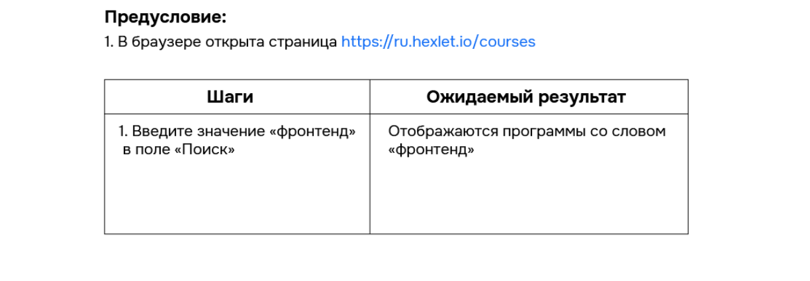
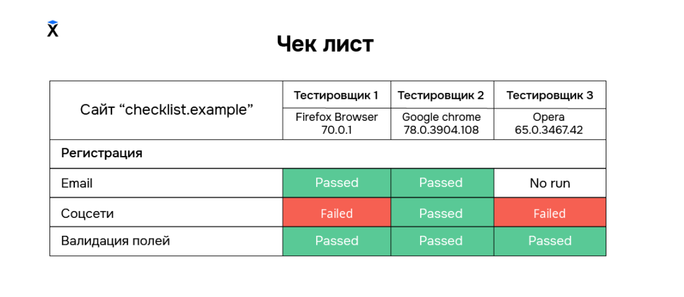
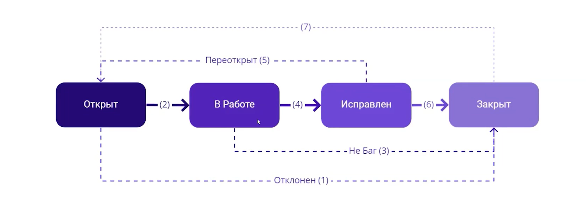

# 📚 Мои заметки по Manual QA

## Оглавление
1. [Требования к ПО](#требования-к-по)
2. [Виды требований](#виды-требований)
3. [Сценарии](#сценарии)
4. [Test-case (Тест-кейс)](#test-case-тест-кейс)
5. [Check-list (Чек-лист)](#check-list-чек-лист)
6. [Принципы составления Test-case / Check-list](#принципы-составления-test-case--check-list)
7. [Test Design (Тест-дизайн)](#test-design-тест-дизайн)
8. [Инструменты тестировщика](#инструменты-тестировщика)
9. [Дефекты (Defects)](#дефекты-defects)
10. [Bug-reports (Баг-репорты)](#bug-reports-баг-репорты)
11. [Жизненный цикл дефекта](#жизненный-цикл-дефекта)
12. [Рабочий процесс тестировщика](#рабочий-процесс-тестировщика)
13. [Регрессионное тестирование](#регрессионное-тестирование)
14. [Работа с дефектами с продакшена](#работа-с-дефектами-с-продакшена)
15. [Неявные требования](#неявные-требования)
16. [Нефункциональное тестирование](#нефункциональное-тестирование)

---

# Требования к ПО

**Требования к ПО** — совокупность утверждений относительно атрибутов, свойств или качеств создаваемой программной системы. Это описание системы; эти требования могут выражаться в виде текста, графических моделей, макетов.

**Пример требований:**
- Описание того, как должна выглядеть система;
- Описание функций, которые должна выполнять система и т.д.

Также **требования используются** в процессе проверки ПО (тестирования), так как тесты основываются на определенных требованиях.

**Требования исходят от:**
* Заказчиков системы;
* Пользователей системы;
* Администраторов и технического персонала;
* НПА — приказов, уставов, законов, распоряжений, регламентов, конституции, положений, описаний бизнес-процессов;
* Экспертов в данной предметной области;
* На основе анализа конкурирующих программных продуктов;
* Отчетов об ошибках, жалоб, запросов на усовершенствование;
* Требований систем, с которыми необходимо обеспечить интеграцию.

**Анализ требований** — процесс сбора требований к ПО, их систематизация, документирование, анализ, выявление противоречий, неполноты, разрешение конфликтов в процессе разработки ПО.

> При разработке требований часто возникают проблемы неполноты, двусмысленности и т.д. Устранение этих проблем на этапе разработки требований стоит на несколько порядков меньше, чем на поздних стадиях разработки.

---

## Виды требований.

**Требования делятся на 2 категории:**

* **Функциональные требования** — описывают основные действия, которые должна выполнять система. Они играют важную роль в разработке, поэтому команда тщательно обдумывает все формулировки. Например, для интернет-магазина функция «Добавить товар в корзину» будет функциональной, потому что без нее приложение не имеет смысла.

* **Нефункциональные требования** — определяют свойства системы, которые не связаны с ее поведением. Это характеристика системы (качество работы системы, отказоустойчивость, безопасность...). Например, способность сайта обрабатывать 100 запросов в минуту — это не функциональность, это характеристика производительности.

**Могут отличаться по уровню детализации:**

* **Явные/прямые** — конкретные инструкции, техническая документация, спецификации и пользовательские истории.
* **Неявные/косвенные** — абстрактные представления о продукте, которые возникают из опыта, здравого смысла или стандартов. Входит всё, что нужно продукту, но не обозначено в документации. Например, если сайт цветной с кнопками «Да/Нет», то у кнопок должен быть цвет — если он не описан, то это неявное требование.
* **Производные** — не зафиксированные требования, которые вытекают из явных требований и относятся к конкретным аспектам системы. Пример: имеется сайт, система которого должна выдерживать нагрузку в 1000 пользователей. Производное требование для него -> Платежная система должна выдерживать 500 запросов в секунду. Для тестирования производных часто используются запросы к API, которые помогают проверить, способен ли сайт принять 100 запросов в минуту без использования интерфейса.

**Требования должны быть:**
* **Единичными** — описывают только 1 вещь.
* **Завершенными** — полностью определены в 1 месте и содержат всю нужную информацию.
* **Ясными**.
* **Атомарными** — описывают только одну функцию, не могут быть разбиты на более детальные требования.
* **Актуальными** — не становятся устаревшими с течением времени.
* **Выполнимыми** в условиях текущего проекта.
* **Не противоречащими** другим требованиям, документации, законодательству.
* **Отслеживаемыми** — полностью/частично соответствуют нуждам, как заявлено в документации.
* **Однозначными** — возможна только одна интерпретация.

---

## Сценарии.

**Позитивные сценарии** — проверяем, как система функционирует в стандартных условиях. Все действия выполняются строго по инструкции.

**Негативные сценарии** — проверка системы в нестандартных условиях. Выполняются некорректные операции и/или используются данные, или намеренно предпринимаются какие-то действия, которые потенциально приведут к ошибке.

> **ВАЖНО!** Негативные тесты предполагают, что приложение даже в критической ситуации поведет себя правильным образом. Проверяют своего рода «защиту от дурака». Например, в поле для ввода номера телефона пытаются ввести буквы/символы, а система в свою очередь должна отреагировать на это предупреждением или блокировать ввод символов, кроме разрешенных (цифр в данном случае).

---

## Test-case (Тест-кейс)

**Test-case (далее TC)** — четкое описание действий, которые необходимо выполнить для того, чтобы проверить работу программы (поля для ввода, кнопки, элементы веб-страницы и т.д.). 

Данное описание содержит:
- **Предусловия** — действия, которые надо выполнить до начала проверки;
- **Шаги** — действия, которые надо выполнить для проверки;
- **Ожидаемый результат** — описание того, что должно произойти после выполнения действий для проверки.

**Пример TC:**

## Check-list (Чек-лист)

**Check-list (далее CL)** — список проверок. Исключает вероятность того, что тестировщик забудет провести какой-либо тест.

**Отличие от Test-case:** Check-list **не описывает подробно все шаги**, а просто перечисляет их. В нем не уточняется, какие тестовые данные нужно использовать и как проводить проверки.

**Пример CL:**

---

## Принципы составления Test-case / Check-list

- 1 TC проверяет только 1 конкретную вещь (требование);
- TC не должен зависеть от других TC (проверка разных функций идет независимо друг от друга, не соединяясь в цепочку; 1 функция — 1 проверка (ТС));
- Шаги и ожидаемый результат ТС должны быть сформулированы четко и однозначно;
- В ТС должна быть вся необходимая информация для его проведения;
- В ТС не должно быть лишних деталей.

---

## Test Design (Тест-дизайн)

**Test design** — этап тестирования ПО. На нем проектируются и создаются тест-кейсы, которые будут соответствовать определенным заранее критериям качества и целям тестирования. 

**Цель тест-дизайна** — создать наборы тестовых случаев, обеспечивающих оптимальное тестовое покрытие.

> Разработка тестов начинается после проведения исследования ПО, когда цели определены, а критерии тестирования заданы и выполняются.

### Техники Test Design

**Помогают:**
- Исключить непродуктивные тест-кейсы и сократить общее количество кейсов;
- Покрыть тестами как можно больше функциональности;
- Провести все тесты и не пропустить ничего важного.

**Для работы с кодом (White-box) важны такие аспекты:**
- Покрытие операторов;
- Покрытие условий;
- Покрытие путей;
- Покрытие функций;
- Покрытие вход/выход;
- Покрытие значений параметров.

**В работе с требованиями (Black-box) тестирование проходит иначе:**
- Классы эквивалентности;
- Граничные значения;
- Попарное тестирование;
- Таблица принятия решений;
- Диаграмма состояний и переходов;
- Тестирование вариантов использования;
- Доменное тестирование.

### Техники Test Design на основании требований

1. **Классы эквивалентности.**
   * **Применение** — разделение диапазона возможных вводимых значений на группы эквивалентных по своему влиянию на систему.
   * **Цель** — помогает не только сокращать количество тестов, но и сохранять приемлемое тестовое покрытие.
   
   **Граничные значения** — значения, в которых один класс эквивалентности переходит в другой. Это техника, которая дополняет технику классов эквивалентности.
   > **Важно проверять граничные значения**, потому что именно на границах чаще всего допускаются ошибки при написании кода и формулировании требований. Например, неопытный программист при постановке «не больше 1000» может поставить значение `< 1000`.

2. **Попарное тестирование (Pairwise).**
   **Pairwise** — техника тест-дизайна, при которой тест-кейсы создаются так, чтобы выполнить все возможные отдельные комбинации каждой пары входных параметров.
   > Достаточно проверить комбинации пар входных параметров, потому что ошибки чаще всего находятся именно на перекрестке двух параметров. Исключения бывают, но они достаточно редкие.

3. **Таблица принятия решений.**
   **Таблица решений / Матрица решений** — способ компактного представления модели со сложной логикой; инструмент для упорядочения сложных бизнес-требований, которые должны быть реализованы в продукте.
   
   **Таблица принятия решений содержит следующие элементы:**
   * **Условия** — список возможных условий;
   * **Варианты** — комбинация из выполнения и/или невыполнения условий этого списка;
   * **Действия** — список возможных действий (вариантов исхода).

4. **Диаграмма состояний и переходов.**
   **Таблица переходов** представляет собой все возможные комбинации начальных и конечных состояний. Она включает в себя **действительные** и **недействительные переходы**, **инициирующие события**, **защитные условия** и **результирующие действия.**
   
   Диаграммы состояний и переходов показывают только действительные переходы и исключают недействительные переходы.
   > ***Состояние А*** —— *переход* —–> ***Состояние Б***

5. **Тестирование вариантов использования.**
   Определяется как метод тестирования ПО, который помогает идентифицировать тестовые случаи, охватывающие всю систему, от транзакции к транзакции от начала до конечной точки.
   
   Вариант использования — *UseCase* — описание конкретного использования системы субъектом или пользователем.
   
   **UseCase содержит следующие сведения:**
   * Кто использует сайт или приложение;
   * Что пользователь хочет сделать;
   * Шаги, которые делает пользователь, чтобы совершить определенное действие;
   * Описание того, как сайт или приложение реагируют на действия пользователя.

6. **Доменное тестирование.**
   **Domain Analysis** — методика разработки тестов, используемая для определения действенных и эффективных тестовых сценариев в случаях, когда множественные параметры могут или должны быть протестированы одновременно.
   
   Применяется для сокращения количества проводимых тестов без потери качества тестирования.

---

## Инструменты тестировщика

* **DevTools**;
* **PICT (Tool for PairWise)** — Pairwise Independent Combinatorial Testing — для подготовки данных для тестирования;
* **TMS** — Test Management System — система управления тестированием, используемая при **организации процесса тестирования**. В них можно создавать и хранить тест-кейсы, организовывать их в тестовые прогоны и анализировать результаты их выполнения.

---

## Дефекты (Defects)

**Дефект** — несоответствие фактического поведения программы его ожидаемому.

Программа содержит дефект, если:
- Не выполняет функцию, которую должна выполнять согласно требованиям;
- Выполняет функцию, которую **не** должна выполнять согласно требованиям;
- То же самое справедливо для свойств программы (безопасность, отказоустойчивость, удобство использования...).

### Разница между Severity и Priority (Важно!)

* **Severity (Серьезность)** — насколько сильно баг ломает систему (Блокирующий, Критический, и т.д.). Ее оценивает **тестировщик**.
* **Priority (Приоритет)** — насколько *срочно* этот баг нужно исправить. Его оценивает **бизнес / продукт-менеджер**.

> *Пример:* Если на сайте дорогого интернет-магазина в названии товара допущена опечатка, **Severity** будет *Trivial* (она не ломает функцию покупки). Но **Priority** будет *High* (Срочно), потому что опечатка в названии бьет по продажам и репутации бренда.

### Уровни серьезности дефектов (Severity):

* **Блокирующий (Blocker)** – дефект полностью блокирует выполнение функционала, нет никакого способа его обойти. **Пример:** Не работает авторизация на сайте (что в свою очередь блокирует большую часть функционала).

* **Критический (Critical)** – дефект блокирует часть функциональности, но есть альтернативный путь для его обхода. **Пример:** В банковском приложении при попытке перевода денег на счет через основной интерфейс возникает ошибка. Однако пользователь может завершить операцию, зайдя в другой раздел приложения или используя веб-версию сервиса.

* **Значительный (Major)** – дефект, указывающий на некорректную работу части функциональности. Другими словами, функция работает, но неправильно. При этом существует более одной точки входа для инициации нужной функциональности. **Пример:** В текстовом редакторе функция автоформатирования кода добавляет неправильные отступы и форматирование, из-за чего код не проходит проверку на стиль. Но редактор все еще позволяет пользователю писать код и сохранять его.

* **Незначительный (Minor)** – дефект, не относящийся к функциональности системы. Обычно уровень Minor проставляется для тех дефектов, которые относятся к удобству использования или интерфейсу. **Пример:** В мобильном приложении кнопка «Назад» на некоторых экранах не отображается в привычном месте, из-за чего пользователю нужно использовать жесты или другие элементы интерфейса. Это не влияет на функциональность, но ухудшает удобство использования.

* **Тривиальный (Trivial)** – дефект, не затрагивающий функциональность системы и почти не влияющий на общее качество системы. Часто неотличим от уровня Minor. **Пример:** В мобильном приложении у кнопки «Отправить» на экране чата слегка отличается оттенок от стандартного, иконка кнопки немного смещена. Это не влияет на работу приложения, и ошибка практически не заметна для большинства пользователей.

---

## Bug-reports (Баг-репорты)

**Bug reports** — отчеты об ошибках или дефектах. Документ, который составляет тестировщик по итогам нахождения дефекта.

**Зачем их составлять?**
1. Передача данной информации разработчикам с целью исправления дефекта.
2. Для сохранения информации о дефекте с целью последующей проверки, исправлен ли дефект.
3. Для составления различных метрик.

**Основные поля баг-репорта:**
* **ID** — уникальный идентификатор бага;
* **Заголовок / Краткое описание / Тема / Summary / Title** — четко и кратко описывает суть бага;
* **Шаги к воспроизведению** — четкое, последовательное описание шагов / действий, которые необходимо совершить, чтобы воспроизвести баг со всей необходимой информацией;
* **Фактический результат** — результат, который мы видим;
* **Ожидаемый результат** — результат, который мы хотели / ожидали увидеть;
* **Серьезность (Severity)** — показывает, насколько серьезные последствия от дефекта с точки зрения влияния на систему.

---

# Жизненный цикл дефекта.

---

## Рабочий процесс тестировщика

**Тестирование новых функциональностей состоит из этапов:** 

1. Тест-дизайн и написание TC на основании требований;
2. Проведение тестирования по новым ТС;
3. Проведение тестирования по старым ТС, чтобы убедиться в том, что новый код не сломал поведение старого функционала (регрессионное тестирование);
4. Заведение дефектов, найденных на этапах 2 (новый функционал) и 3 (регрессионное тестирование).

**Тестирование «исправленных» дефектов:**
1. Ретест — проведение тестирования по уже написанным ТС, в которых действительный результат во время проведения прошлой итерации не соответствовал ожидаемому;
2. Регрессионное тестирование;
3. Заведение дефектов, обнаруженных на этапах 1 и 2.

**Тестирование дефектов с продакшена (от клиентов, заказчиков, пользователей):**
1. Воспроизведение и локализация дефекта;
2. Заведение дефекта, если требуется;
3. Создание и/или редактирование ТС, описывающих проверку, которую необходимо провести после «исправления».

---

## Регрессионное тестирование

**Регрессионное тестирование** — вид тестирования, направленный на проверку изменений, сделанных в приложении или окружающей среде, для подтверждения того факта, что существующая ранее функциональность работает так, как ожидается.

> Регрессионными могут быть как функциональные, так и нефункциональные тесты.

Рекомендуется проводить каждый раз после корректировки программы / сайта. Изменения могут включать в себя исправление дефектов, слияние кода, миграцию на другую ОС или БД, добавление новой функциональности и др.

---

## Работа с дефектами с продакшена

**Шаги:**
1. Перевести проблему в дефект — действительно ли проблема в ПО?
2. Максимально локализовать дефект — из-за чего проблема?
3. Завести дефект в систему регистрации и определить его серьезность.
4. В зависимости от серьезности — принимать решение об исправлении.
5. Написать тестовую документацию, чтобы потом проверить, действительно ли дефект исправлен.
6. Когда «дефект» исправлен — проверить.
7. Провести регрессионное тестирование (в зависимости от исправленного дефекта).
8. Выкатить на прод.

---

## Неявные требования

**Неявные требования** — информация о необходимом поведении, внешнем виде и свойствах системы, не внесенная в ТЗ и спецификации, а также не включенная в постановку задач вне зависимости от того, в каком формате они поставлены.

Могут истекать из:
- Незарегистрированных запросов от заказчика;
- Законов, актов и стандартов;
- Устных договоренностей;
- Профессионального опыта.

Тестирование таких требований **гораздо сложнее**, как в плане обнаружения ошибок, так и написании отчета о них.

> **Пример:** Программа, которая высчитывает площадь треугольника.
> *Явные требования:* На вход подаются три числа, обозначающие стороны треугольника в сантиметрах. Результат программы — площадь треугольника в сантиметрах.
> *Неявное требование:* Введенные числа должны соответствовать возможным значениям длин сторон треугольника. Например, треугольника со сторонами 1, 2, 3 не существует. Нужна дополнительная проверка — сумма длин любых двух сторон всегда должна быть строго больше длины третьей.

---

## Нефункциональное тестирование

**Нефункциональное тестирование** — тестирование качественных характеристик компонента или системы, которые могут быть измерены различными величинами, **не относящимися к конкретной функции** или действию пользователя.

**К нефункциональному тестированию относятся:**
* **UX-тестирование** — понятность и привлекательность интерфейса;
* **UI-тестирование** — верстка, шрифт и прочее;
* **Тестирование безопасности**;
* **Тестирование установки** — разное ПО: iOS, Android;
* **Тестирование конфигурации** — функционал, режимы;
* **Тестирование совместимости** — например, кросс-браузерной совместимости;
* **Тестирование производительности**;
* **Тестирование на отказ и восстановление**;
* **Тестирование локализации и интернационализации**.